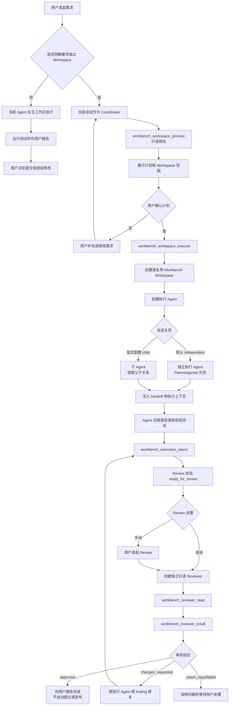

# Agent Workspace 完整流程

本文从使用者的角度说明：发起一个开发需求后，Workspace Workbench 如何判断执行位置、何时创建 Workspace、各个 Agent 分别负责什么，以及代码如何经过 Review 形成闭环。

## 一句话规则

- 没有明确要求隔离时，Agent 直接在当前工作区完成需求。
- 用户明确要求创建新的 Workspace、独立工作区、隔离目录或独立分支时，才启动 Workbench 隔离流程。
- 用户只需要表达需求和隔离意图，不需要描述 MCP、handoff、Agent 创建或 Review 的内部步骤。

## 总体流程



## 两种执行模式

### 当前工作区模式

用户可以直接说：

```text
直接在当前工作区修复这个问题：修复 README 中的命令说明。
```

这种情况下：

1. 当前 Agent 直接检查和修改当前 checkout；
2. 不创建 Workbench Workspace；
3. 不创建新的执行 Agent；
4. Agent 完成测试后直接向用户报告；
5. 是否提交、合并或发布由用户决定。

这是默认的低成本模式，适合小修改、快速验证和用户明确要求直接修改当前项目的场景。

### 独立 Workspace 模式

用户可以说：

```text
创建一个新的 Workspace 来完成这个需求：修复 README 中的命令说明。
先给我计划，确认后再执行。
```

也可以使用以下等价表达：

- 在独立工作区中完成；
- 使用隔离目录处理；
- 在独立分支中实现；
- 不要影响当前工作区；
- 新建一个工作空间来完成。

这种情况下，Coordinator 应该自动完成下面的流程，用户不需要描述内部工具调用：

1. 调用 `workbench_workspace_preview`，只读检查项目、仓库、基准和目标范围；
2. 展示计划和 Workspace 预览；
3. 用户确认后，使用相同请求身份调用 `workbench_workspace_execute`；
4. Workbench 创建或复用隔离 Workspace，并准备对应的 Git worktree；
5. 创建执行 Agent，把已确认的 handoff、目录和约束传给它；
6. Coordinator 不在当前主工作区继续修改，也不代替执行 Agent 工作；
7. 执行 Agent 在隔离目录中修改、测试并提交执行报告；
8. Workbench 保存状态，进入 Review 流程。

## 三类会话的职责

### Coordinator

Coordinator 是用户当前看到的会话，负责：

- 理解需求和隔离意图；
- 生成计划并请求用户确认；
- 调用 Workspace 预览、执行和状态查询；
- 启动或查询 Review；
- 向用户汇报结果和下一步选择。

当用户选择独立 Workspace 时，Coordinator 不应该直接编辑目标文件。

Coordinator 可以使用的主要工具是：

```text
workbench_workspace_preview
workbench_workspace_execute
workbench_workspace_status
workbench_review_preview
workbench_review_execute
workbench_review_status
workbench_review_stop
workbench_review_resume
```

### 执行 Agent

执行 Agent 是 Workbench 为本次需求创建的工作会话，负责：

- 验证分配到的 Workspace 和 worktree；
- 修改代码或文档；
- 运行相关测试；
- 在任务完成、需要用户输入或失败时提交结构化报告。

默认会话关系是 `independent`：

```text
ParentAgentId = null
```

它拥有自己的会话和生命周期，不依赖 Coordinator 持续等待，也不会因为 Coordinator 结束而自动接管或回灌工作。只有项目设置、provider 设置或本次任务明确选择 `child` 时，才使用父子 Agent 关系。

执行 Agent 只获得执行所需的上下文和报告工具：

```text
workbench_execution_report
```

它不能递归创建另一个 Workspace，也不能使用 Coordinator 的完整编排工具。

### Reviewer

Reviewer 是独立的只读审核会话，负责：

1. 读取 Workbench 固定的变更快照；
2. 检查需求、代码、测试和已知限制；
3. 返回结构化审核结果。

Reviewer 始终满足：

- 独立会话；
- `ParentAgentId = null`；
- 只读 sandbox；
- 不能修改文件；
- 不能创建 Workspace；
- 不能替执行 Agent 修复问题。

Reviewer 只使用：

```text
workbench_reviewer_read
workbench_reviewer_result
```

同一个 Review 默认复用同一个 Reviewer。项目可以选择每轮新建 Reviewer，但这属于高级设置。

## Execution Report 和 Review 闭环

普通 Agent turn 结束不等于任务完成。执行 Agent 必须通过专用报告工具提交结果：

```text
ready_for_review
needs_input
failed
```

其中：

- `ready_for_review`：执行完成，允许进入 Review；
- `needs_input`：需求存在歧义或需要用户决定；
- `failed`：执行或验证失败，需要用户处理。

### 审核通过

Reviewer 返回 `approved` 后：

- 当前变更版本通过审核；
- Coordinator 向用户报告结果；
- Workbench 不自动提交、合并或发布；
- 用户可以继续修改、提交或合并 Workspace。

### 需要修改

Reviewer 返回 `changes_requested` 后：

1. Workbench 保存 finding，包括文件、位置、问题和建议；
2. 修复消息发送回原执行 Agent；
3. 原执行 Agent 在同一个 Workspace 中修复；
4. 执行 Agent 再次提交 `ready_for_review`；
5. 默认由同一个 Reviewer 继续复审；
6. 直到 `approved`、达到审核轮次限制，或进入阻塞状态。

Reviewer 不会越权替执行 Agent 修改文件。

## 用户最少需要输入什么

### 只想直接完成需求

```text
直接在当前工作区完成：给设置页面增加一个重置按钮。
```

### 想要隔离执行

```text
创建一个新的 Workspace 来完成：给设置页面增加一个重置按钮。
先给我计划，确认后执行。
```

计划确认时只需要：

```text
按计划执行。
```

如果 Review 设置为手动，执行报告进入 `ready_for_review` 后，用户再说：

```text
开始 Review。
```

如果项目启用了自动 Review，则不需要这一步。

## 状态和身份保证

独立 Workspace 流程中，系统需要持续保证：

- `preview` 不创建 Workspace、worktree 或 Agent；
- `execute` 使用已确认的请求身份；
- 相同请求重试不会重复创建执行 Agent；
- 不同需求不会静默复用旧执行 Agent；
- `status` 只需要请求身份和可选 Workspace 身份；
- 执行 Agent 的报告必须通过认证的 report-only 通道提交；
- Reviewer 只能读取与当前 Review 身份匹配的固定快照；
- 任务最终不会自动提交、发布或推送远程仓库。

Coordinator 必须从已登记项目的项目根目录创建或打开。普通 Paseo 的通用 worktree 不会自动被当作 Workbench Workspace，避免把不受管理的目录误接入隔离流程。
